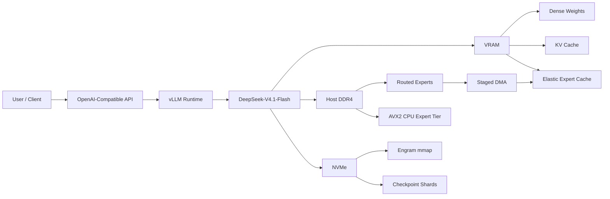
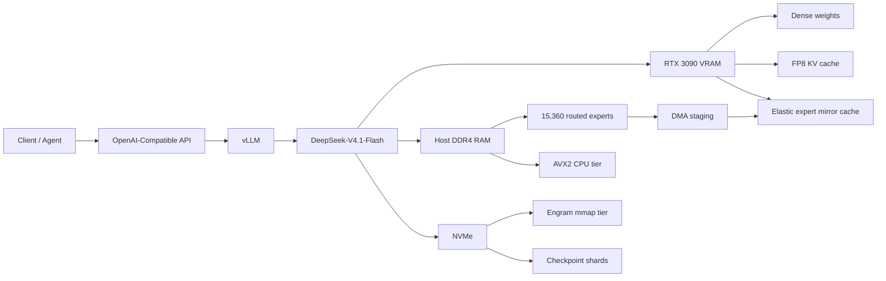
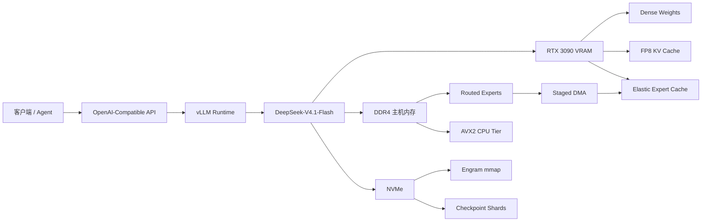

# dsv41-flash-offload — Complete Trilingual Project Post


**Project / پروژه / 项目:** [dsv41-flash-offload](https://github.com/HamidYaraliOfficial/dsv41-flash-offload)  
**Developer / توسعه‌دهنده / 开发者:** **Hamid Yarali — حمید یارعلی — 哈米德·亚拉利**

> **Publication note:** This file expands the previous three-language version without removing the supplied technical README. The complete supplied README is preserved verbatim at the end of this document.

---

# 🇮🇷 فارسی — نسخه کامل برای انتشار

## 🚀 اجرای DeepSeek-V4.1-Flash روی تنها یک RTX 3090 با 24GB VRAM

با افتخار پروژه **dsv41-flash-offload** را معرفی می‌کنم؛ یک پیاده‌سازی مهندسی‌شده برای سرویس‌دهی به **DeepSeek-V4.1-Flash** در شرایطی که اندازه مدل بسیار فراتر از ظرفیت معمول حافظه GPU است.

ایده اصلی پروژه، طراحی یک **Memory-Tiered Inference Architecture** است که در آن VRAM، RAM، CPU و NVMe مانند لایه‌های هماهنگ حافظه و محاسبات عمل می‌کنند. Expertهای Routed در RAM میزبان نگه داشته می‌شوند، در زمان Prefill با Staged DMA به VRAM منتقل می‌شوند، Expertهای پرتکرار در یک Elastic VRAM Cache قرار می‌گیرند و missهای سرد در زمان Decode می‌توانند با هسته AVX2 روی CPU پردازش شوند. جدول‌های Engram نیز به‌جای اشغال RAM به‌صورت memory-mapped روی NVMe نگهداری می‌شوند.


### 🎯 چرا این پروژه مهم است؟

مدل‌های MoE بزرگ فقط با افزایش VRAM قابل اجرا نیستند؛ مسئله اصلی، **Memory Capacity، PCIe Bandwidth، Data Movement، Cache Locality و Compute Placement** است. این پروژه تلاش می‌کند این محدودیت‌ها را با ترکیب چند تکنیک مهندسی برطرف کند:

`VRAM cache` + `host-resident experts` + `staged DMA` + `CPU expert tier` + `NVMe Engram tier`

نتیجه، یک مسیر inference است که بخش‌های مختلف مدل را در مناسب‌ترین tier قرار می‌دهد و در عین حال یک API سازگار با OpenAI در اختیار مصرف‌کننده قرار می‌دهد.

### ⚙️ اجزای اصلی

- **DeepSeek-V4.1-Flash** با **EXL3 3.0 bpw**
- **384 Routed Experts × 40 MoE Layers**
- یک **NVIDIA RTX 3090 24GB** به‌عنوان شتاب‌دهنده اصلی
- **Host DDR4 RAM** برای نگهداری Expertها
- **Staged-DMA Prefill** و Copy Engine برای انتقال گروهی Expertها
- **FP16 GEMM** برای Expertهای پرترافیک در staging slot
- **AVX2 CPU Expert Tier** برای Cold Decode Misses
- **Elastic VRAM Expert Cache** برای نگهداری Expertهای داغ
- **Engram Disk Tier** روی NVMe با memory mapping
- **OpenAI-compatible API** برای chat، reasoning، tool calls و completions
- پشتیبانی از context window تا **262,144 token** در تنظیمات پیش‌فرض مستندشده

### 📊 عملکرد گزارش‌شده

در پیکربندی D141 مستندشده در README:

| شاخص | مقدار گزارش‌شده |
|---|---:|
| GPU | 1× RTX 3090 24GB |
| Decode، 1 stream | 19.3 tok/s |
| Decode، 2 stream | 24.0 tok/s |
| Decode، 4 stream | 26.6 tok/s |
| Prefill | حدود 690–790 tok/s در بازه‌های مختلف context |
| Long-context test | تا حدود 261k token |
| Default context | 262,144 token |
| KV cache | 1.5 GiB fp8 در پیکربندی پیش‌فرض |
| Host RAM recommended | 256 GiB در اندازه‌گیری مستندشده |
| NVMe recommended | 1 TB برای فضای آزاد موردنیاز مستندشده |

در یک آزمایش تجربی جداگانه، Expert Tier روی **Intel Arc B70** نیز به **41.3 tok/s در 4 stream** رسیده است؛ کیفیت A/B این آزمایش در README به‌عنوان pending ذکر شده است.

### 🧠 معماری مفهومی



### 🔬 مهندسی مسیر Prefill و Decode

**Prefill:** Expertهای لازم از RAM میزبان به staging slotهای VRAM منتقل می‌شوند و Expertهای پرمصرف می‌توانند به‌صورت FP16 GEMM اجرا شوند. در chunkهای بزرگ‌تر، هزینه انتقال PCIe بهتر amortize می‌شود و overlap بین transfer و compute ایجاد می‌شود.

**Decode:** Elastic cache تلاش می‌کند hot expertها را در VRAM نگه دارد. زمانی که یک expert در cache وجود ندارد، CPU Expert Tier می‌تواند miss را مستقیم از کپی pinned در RAM محاسبه کند و partial نتیجه را به GPU برگرداند.

**Engram:** جدول‌های n-gram عظیم Engram به‌جای بارگذاری کامل در RAM روی NVMe memory-map می‌شوند و فقط داده موردنیاز هر مرحله از دیسک/page cache جمع‌آوری می‌شود.

### 🖥️ سخت‌افزار مورد نیاز

README اندازه‌گیری‌شده پروژه نشان می‌دهد که اجرای مستندشده به‌صورت تقریبی به موارد زیر نیاز دارد:

**GPU:** یک کارت 24GB سازگار با sm_86، مانند RTX 3090.  
**RAM:** حداقل عملی توصیه‌شده برای همان اندازه‌گیری، **256 GiB**.  
**CPU:** معماری x86-64 با **AVX2 / FMA / F16C** و ظرفیت محاسباتی کافی برای CPU tier.  
**Storage:** NVMe سریع؛ برای فضای آزاد موردنیاز در پیکربندی مستندشده، **1 TB** پیشنهاد شده است.  
**PCIe:** مسیر پرسرعت مهم است، زیرا بخش زیادی از Expertها در VRAM نیستند.

> توجه: این اعداد مربوط به پیکربندی و اندازه‌گیری‌های مستندشده در خود پروژه هستند و نباید به‌عنوان تضمین عملکرد برای هر سخت‌افزار دیگری تلقی شوند.

### 🧪 Quality و Fidelity

یکی از نکات مهم و حرفه‌ای پروژه این است که فقط benchmark سرعت گزارش نشده، بلکه **fidelity** نیز بررسی شده است. در تست D061، top-1 agreement برابر **0.9856** و mean KL برابر **0.0068 nats** ثبت شده و inherited guard را fail کرده است. README توضیح می‌دهد که مسیر `EXL3_DMA_GEMM=1` به دلیل بازسازی وزن‌ها و تفاوت در ترتیب accumulation چند position را جابه‌جا می‌کند؛ median KL بسیار کوچک‌تر است اما معیار کلی guard را پاس نکرده است.

این بخش مهم است، چون پروژه صرفاً «بیشتر کردن tok/s» نیست و trade-off بین **speed و numerical fidelity** را صریحاً اندازه‌گیری می‌کند.

### 📦 اجرای سریع با Docker

نمونه اجرای اصلی پروژه در README شامل آماده‌سازی inputها و سپس اجرای سرویس با GPU، حافظه اشتراکی، memory limit بالا و `IPC_LOCK` است. برای reproducibility نیز digest، commit، build attestation و scriptهای prepare / verify در مستندات پروژه ثبت شده‌اند.

```bash
docker build -f docker/Dockerfile -t dsv41-flash-offload .
```

اجرای نمونه:

```bash
IMAGE=ghcr.io/0xsero/dsv41-flash-offload@sha256:c247bad773a3d31af7420d99ead6d1d521f20d50df4b6c346c26f80f5ca30cf3
MODEL_ROOT=/srv/models
CACHE_ROOT=/srv/cache/dsv41
```

و سپس `prepare` و `serve` مطابق دستورهای کامل README.

### 🔌 OpenAI-Compatible API

مدل سرویس‌شده با نام `deepseek-v4.1-flash` در دسترس قرار می‌گیرد و README مسیرهای `/v1`، API key، chat completions، tool calling و reasoning parser را مستند کرده است.

### 📈 نتیجه‌ای که برای من در این پروژه جالب است

نکته اصلی برای من فقط اجرای یک مدل بزرگ روی یک GPU نیست؛ بلکه طراحی یک **heterogeneous inference pipeline** است که در آن:

**GPU → compute + hot cache**  
**CPU → cold expert computation**  
**RAM → expert home storage**  
**NVMe → very-large persistent data tier**

همگی به‌صورت هماهنگ کار می‌کنند.

👨‍💻 **Developed & Engineered by Hamid Yarali (حمید یارعلی)**

🔗 **GitHub:** https://github.com/HamidYaraliOfficial/dsv41-flash-offload

#DeepSeek #DeepSeekV41 #AI #LLM #GPU #RTX3090 #MachineLearning #Inference #CUDA #vLLM #EXL3 #OpenSource #Optimization #HamidYarali

---

# 🇬🇧 English — Full Publication Version

## 🚀 DeepSeek-V4.1-Flash on a Single 24GB RTX 3090

I’m excited to share **dsv41-flash-offload**, an engineering-focused implementation for serving **DeepSeek-V4.1-Flash** when the model footprint is far beyond the normal VRAM budget of a single consumer GPU.

The central idea is a **memory-tiered inference architecture** in which VRAM, host RAM, CPU compute, and NVMe storage operate as coordinated tiers. Routed experts remain in host RAM; during prefill, the copy engine streams them into VRAM staging slots; busy experts can execute as FP16 GEMMs; during decode, an elastic VRAM mirror cache keeps the hottest experts while an AVX2 CPU tier handles cold misses. Large Engram n-gram tables remain memory-mapped on NVMe.


### Why this is technically interesting

Large MoE inference is not only a VRAM-capacity problem. It is also a problem of **PCIe bandwidth, data movement, cache locality, placement, compute scheduling, and memory pressure**. This project combines:

`VRAM expert cache` + `host-resident experts` + `staged DMA` + `CPU expert tier` + `NVMe Engram tier`

to build a heterogeneous inference path around a single 24GB GPU.

### Key components

- DeepSeek-V4.1-Flash with **EXL3 3.0 bpw quantization**
- **384 routed experts across 40 MoE layers**
- **1× NVIDIA RTX 3090 24GB**
- Host DDR4 for the routed expert home copy
- **Staged-DMA prefill** using copy-engine staging
- **FP16 GEMM** for busy experts in staging slots
- **AVX2 CPU expert tier** for cold decode misses
- **Elastic VRAM expert cache** for hot `(layer, expert)` pairs
- Memory-mapped **Engram tables on NVMe**
- **OpenAI-compatible API** for chat, reasoning, tool calls, and completions
- Default documented context length of **262,144 tokens**

### Reported performance

| Metric | Reported value |
|---|---:|
| GPU | 1× RTX 3090 24GB |
| Decode, C1 | 19.3 tok/s |
| Decode, C2 aggregate | 24.0 tok/s |
| Decode, C4 aggregate | 26.6 tok/s |
| Prefill | ~690–790 tok/s across tested context sizes |
| Long-context test | ~261k prompt tokens |
| Default context | 262,144 tokens |
| Default KV | 1.5 GiB FP8 |
| Host RAM | 256 GiB recommended for the measured configuration |
| Storage | 1 TB drive recommended for the measured free-space requirement |

An experimental Intel Arc B70 expert tier is reported at **41.3 tok/s with 4 streams**; the README marks quality A/B as pending for that experiment.

### High-level architecture



### Prefill vs. decode

**Prefill** uses staged DMA so that cold experts are streamed into VRAM in batches, reducing the effective transfer overhead and overlapping data movement with GPU compute. Busy experts can use FP16 GEMM.

**Decode** benefits from the elastic expert cache. Hot experts stay in VRAM, while CPU execution is used for cold misses. The project documents a measured CPU tier using 22 host threads in the D119 configuration.

**Engram** is treated as a disk tier: the large tables are memory-mapped on NVMe instead of being fully resident in RAM, with required rows gathered on demand.

### Measured host requirements

For the measured D119 server, the README reports roughly **194 GiB** anonymous host memory for pinned experts/process state and a container peak around **212.1 GiB**, leading to a recommended **256 GiB host** when a substantial buffer is included. The measured NVMe payload is about **457.9 GB**, with the project recommending roughly **488 GB of free space**, hence a **1 TB drive** in practice.

### Fidelity matters too

The project also measures numerical fidelity, not just speed. D061 reports a **0.9856 top-1 agreement** and **0.0068 nats mean KL** against the frozen reference panel and is explicitly marked as failing the inherited guard. The README attributes the movement of a small number of positions to FP16 GEMM reconstruction and accumulation-order differences.

That is an important engineering detail: the project documents the **speed/quality trade-off** instead of presenting throughput in isolation.

### Reproducibility

The repository records pinned images, commits, source patches, receipt hashes, benchmark scripts, launch scripts, model input revisions, and a build-attestation workflow. The documented default image can also be built locally with:

```bash
docker build -f docker/Dockerfile -t dsv41-flash-offload .
```

The full `prepare`, `serve`, smoke-test, configuration, context-length, and benchmark commands are retained verbatim in the technical appendix below.

👨‍💻 **Developed & Engineered by Hamid Yarali**

🔗 GitHub: https://github.com/HamidYaraliOfficial/dsv41-flash-offload

#DeepSeek #DeepSeekV41 #AI #LLM #GPU #RTX3090 #Inference #MachineLearning #CUDA #vLLM #EXL3 #OpenSource #Optimization #HamidYarali

---

# 🇨🇳 中文 — 完整发布版本

## 🚀 在单张 24GB RTX 3090 上运行 DeepSeek-V4.1-Flash

我很高兴分享 **dsv41-flash-offload** 项目。这是一个面向工程实践的实现，用于在模型整体内存需求远超单张消费级 GPU 显存容量时，为 **DeepSeek-V4.1-Flash** 提供高效推理服务。

项目的核心思路是构建一个 **分层内存推理架构（Memory-Tiered Inference Architecture）**：GPU 显存、主机 DDR4 RAM、CPU 计算能力以及 NVMe 存储共同组成协同工作的资源层。Routed Experts 常驻在主机内存；Prefill 时通过 Copy Engine 和 Staged DMA 分批传入 VRAM；热点 Expert 可以通过 FP16 GEMM 执行；Decode 时使用 Elastic VRAM Expert Cache 保存热点 Expert，而冷 Expert miss 则可以交给 AVX2 CPU Expert Tier。大型 Engram n-gram 表则采用 memory-mapped 方式保存在 NVMe 上。


### 为什么这个项目值得关注？

大型 MoE 推理并不只是显存容量问题，同时也是 **PCIe 带宽、数据搬运、缓存局部性、计算位置以及内存压力**的问题。本项目将以下技术组合起来：

`VRAM Expert Cache` + `Host-Resident Experts` + `Staged DMA` + `CPU Expert Tier` + `NVMe Engram Tier`

从而在单张 24GB GPU 上建立异构推理路径。

### 核心组件

- **DeepSeek-V4.1-Flash + EXL3 3.0 bpw 量化**
- **40 个 MoE 层中的 384 个 Routed Experts**
- **1× NVIDIA RTX 3090 24GB**
- DDR4 主机内存作为 Routed Experts 的 home copy
- 使用 **Staged-DMA Prefill** 进行分阶段数据传输
- 对热点 Expert 使用 **FP16 GEMM**
- 使用 **AVX2 CPU Expert Tier** 处理冷 Decode Miss
- 使用 **Elastic VRAM Expert Cache** 缓存热点 `(layer, expert)` 对
- **NVMe memory-mapped Engram table**
- 提供 **OpenAI-compatible API**，支持 Chat、Reasoning、Tool Calling 和 Completions
- 默认支持 **262,144-token context**

### 已记录性能

| 指标 | 已报告数值 |
|---|---:|
| GPU | 1× RTX 3090 24GB |
| Decode，C1 | 19.3 tok/s |
| Decode，C2 aggregate | 24.0 tok/s |
| Decode，C4 aggregate | 26.6 tok/s |
| Prefill | 不同 context 下约 690–790 tok/s |
| 长上下文测试 | 约 261k prompt tokens |
| 默认上下文 | 262,144 tokens |
| 默认 KV | 1.5 GiB FP8 |
| Host RAM | 对应测量配置推荐 256 GiB |
| Storage | 对应测量的空闲空间要求推荐 1 TB |

此外，实验性的 Intel Arc B70 Expert Tier 在记录中达到 **4 streams、41.3 tok/s**；README 明确说明该实验的质量 A/B 仍处于 pending 状态。

### 高层架构



### Prefill 与 Decode

**Prefill：** 将冷 Expert 通过 staged DMA 批量送入 VRAM，从而降低 PCIe 传输带来的整体成本，并尽可能与 GPU 计算进行 overlap；高路由负载 Expert 可以使用 FP16 GEMM。

**Decode：** Elastic Expert Cache 保留热点 Expert。对于 cache miss，CPU Expert Tier 可以直接从 pinned host copy 中执行计算，并将 partial result 合并回 GPU 路径。

**Engram：** 大型 Engram 表不需要全部加载到 RAM，而是通过 NVMe memory mapping 作为磁盘层，按需获取每一步需要的数据。

### 主机资源与可复现性

项目测量的 D119 主机环境包括高容量 DDR4、24 核 CPU、RTX 3090 和 NVMe。README 报告容器峰值内存约 **212.1 GiB**，并以较大缓冲区为基础推荐 **256 GiB** 主机；NVMe 的实测内容约 **457.9 GB**，因此实践上推荐 **1 TB** 存储设备。

项目还记录了固定镜像、commit、补丁、hash receipts、benchmark scripts、launch scripts、模型输入版本以及 build attestation，从而增强实验的可复现性。

### 不仅关注速度，也关注数值一致性

D061 的 fidelity 测试给出 **0.9856 top-1 agreement** 和 **0.0068 nats mean KL**，并明确标记为未通过 inherited guard。README 对原因进行了工程层面的解释：FP16 GEMM 路径对权重进行重建并采用不同的累加顺序，因此少量 position 会发生变化。

这意味着项目并没有只展示吞吐率，而是同时展示了 **性能与数值一致性之间的工程 trade-off**。

👨‍💻 **Developed & Engineered by Hamid Yarali（حمید یارعلی）**

🔗 GitHub： https://github.com/HamidYaraliOfficial/dsv41-flash-offload

#DeepSeek #DeepSeekV41 #AI #LLM #GPU #RTX3090 #Inference #MachineLearning #CUDA #vLLM #EXL3 #OpenSource #Optimization #HamidYarali

---

# 🔗 Project Resources / منابع پروژه / 项目资源

| Resource | Link |
|---|---|
| Main GitHub repository | https://github.com/HamidYaraliOfficial/dsv41-flash-offload |
| Project banner (upstream repository asset) | https://raw.githubusercontent.com/0xSero/dsv41-flash-offload/main/docs/banner.svg |
| Upstream reference repository found during review | https://github.com/0xSero/dsv41-flash-offload |
| DeepSeek-V4.1-Flash model | https://huggingface.co/deepseek-ai/DeepSeek-V4.1-Flash |
| EXL3 quantized model referenced by the README | https://huggingface.co/Mia-AiLab/DeepSeek-V4.1-Flash-EXL3-3.0bpw |
| vLLM | https://github.com/vllm-project/vllm |
| exllamav3 | https://github.com/turboderp-org/exllamav3 |
| vllm-exl3 | https://github.com/vcruz305/vllm-exl3 |

---

# ⚠️ Publication / Licensing Note

The supplied README's Credits section says **“The code in this repository is MIT”**, while the current GitHub repository page for `HamidYaraliOfficial/dsv41-flash-offload` currently surfaces an **Apache-2.0 license**. These are not the same license. Before publishing this text as a formal project README or legal attribution statement, the repository `LICENSE` and README should be reconciled so that the displayed license is unambiguous.

The project also relies on upstream components with their own licenses and credits; those should remain attributed to their respective authors/projects.

---

# 📚 Complete Original Technical README — PRESERVED VERBATIM

> **The following section is intentionally left unchanged from the supplied README. No technical section, command, benchmark, configuration variable, result, layout entry, or credit from the supplied file has been removed.**

\# dsv41-flash-offload

![DeepSeek-V4.1-Flash on one RTX 3090]\(docs/banner.svg)

\## At a glance

\| | |

\|---|---|

\| Model | DeepSeek-V4.1-Flash, EXL3 3.0 bpw (about 200 GB of experts), 262,144-token context |

\| Hardware | 1x RTX 3090 24 GB, 256+ GiB RAM, an AVX2 CPU with 24+ cores, NVMe |

\| Default (D141) | decode 19.3 / 24.0 / 26.6 tok/s at 1 / 2 / 4 streams; prefill 690-790 tok/s from 8k to 261k |

\| Quality (D141) | 50/50 long-prompt and long-task runs correct at C1 and C4: needle retrieval at 8k/64k/200k, executed code tests, math, long essays. See [results/Q001-d141-quality]\(results/Q001-d141-quality/) |

\| Image | *\`ghcr.io/0xsero/dsv41-flash-offload\:d141-main\`*, pinned digest and attestation under [Run]\(#run) |

\| Experimental | Intel Arc B70 expert tier: **\*\*41.3 tok/s at 4 streams (+55%)\*\***, crash root-caused and fixed, quality A/B pending. See [experimental/b70-tier]\(experimental/b70-tier/) |

Serve **\*\*DeepSeek-V4.1-Flash\*\*** (EXL3 3.0 bpw, 384 routed experts x 40 MoE layers, Engram n-gram tables) from \*\*one

24 GB RTX 3090\*\* plus host DDR4 and NVMe, with an OpenAI-compatible API (chat with tool calls and reasoning,

completions). All routed experts are pinned in host RAM. During prefill the copy engine streams them into VRAM slots

in batches, and busy experts run as FP16 GEMMs. During decode a VRAM mirror cache holds the hottest experts and an

AVX2 kernel on the host cores computes the cold misses. The Engram tables stay memory-mapped on NVMe.

This is the code and configuration of run **\*\*D119\*\*** (= D118 at 262k context) of the FreeToken-EXL3 campaign: D061 (staged-DMA prefill, fat

threshold 32) + the CPU expert tier + the **\*\*elastic\*\*** VRAM expert cache. Stack: vLLM 0.13 (lazymio/vllm-backport,

DeepSeek-V4.1 support) + Ampere patches + the *\`vllm_exl3\`* plugin with exllamav3 kernels, built for sm_86. A few small

source patches go on top, and the image applies them at build time.

Status: **\*\*candidate\*\***. The default launch (262,144-token context, 1.5 GiB fp8 KV) was measured end to end as run

**\*\*D119\*\*** at C1 from 8k to 261k tokens: prefill 589-813 tok/s, decode 16.4-20.9 tok/s (table below). Prefill

fidelity of the staged-DMA path is just outside the campaign's inherited guard (see [Quality]\(#quality)).

\## Current default: D141 (2026-10-03)

D140 + near-full-window requests (agent compaction at \~250k with max_tokens) accepted instead of HTTP 400.

D135 + CPU-assisted prefill for lone 513-2048-token agent turns (6.5-7.8 s instead of 8.3-8.6 s to first token). D135 = D130 below plus a tuned CPU/GPU split (C1/C2/C4 19.8/23.0/25.6) and cross-layer DMA prefetch (prefill 8k/64k/261k

787/769/694 tok/s). See [results/D130.md]\(results/D130.md).

\### D130

Prefix caching (exact), CPU-tier split path for <= 512-token steps, safe elastic expert cache, 8 staging slots,

decode share during long prefills. Decode C1/C2/C4 18.8/22.0/23.5 tok/s (was 15.3/16.7/17.6); prefill 8k/64k/261k

709.6/698.1/620.4 tok/s; a cached 131k-token agent turn reaches its first token in 0.76 s instead of 200.8 s; 30-min

4-worker soak 0 errors / 0 OOM. Details and before/after table: [results/D130.md]\(results/D130.md).

\## Measured

Host: AMD EPYC 7443P (24 cores, SMT on, Zen 3), 503 GiB DDR4 (8 channels), 1x RTX 3090 24 GB on PCIe 4.0 x16,

Samsung 990 PRO 4 TB NVMe (dm-crypt). Protocol (campaign *\`bench/sweep_prefill_terminal.py\`* over *\`bench/sweep.py\`*,

*\`--prefill 8192 32768 --conc 1 2 4 --reps 3 --dec-reps 2\`*):

\- Prefill = median of 3 fresh random-token prompts, input tokens / latency of the first result.

\- Decode = greedy completions run to their natural end with C simultaneous streams. Aggregate = all completion

  tokens / wall time, median of 2 rounds.

All runs below used *\`--max-model-len 65536\`*, *\`--max-num-seqs 4\`*, fp8 KV, no prefix caching, and CUDA graphs for

decode (FULL_DECODE_ONLY, sizes 1-24).

\| run | change | prefill 8k | prefill 32k | decode C1 | decode C2 agg | decode C4 agg | KV | chunk | evidence |

\|---|---|---|---|---|---|---|---|---|---|

\| D030 | baseline: experts zero-copy over PCIe, no CPU tier | 93.4 | 95.8 | 4.10 | 4.60 | 4.95 | 2 GiB | 1,024 | [results/D030]\(results/D030/sweep.json) |

\| D107 | + AVX2 CPU tier + VRAM expert cache (709 slots, 8.76 GiB), best decode | 96.9 | 98.6 | 21.34 | 26.27 | 28.30 | 1 GiB | 1,024 | [results/D107]\(results/D107/sweep.json) |

\| D061 | staged-DMA prefill + FP16 GEMM for busy experts (fat threshold 32), cache off, decode not measured | 565.2 | 744.9 | - | - | - | 1 GiB | 16,384 | [results/D061]\(results/D061/sweep.json) |

\| D117 | D061 + CPU tier + non-elastic expert cache (cache starved by prefill buffers) | 575.2 | 765.5 | 15.55 | 17.74 | (sweep running at capture) | 1 GiB | 16,384 | [results/D117]\(results/D117/sweep.json) |

Units are tok/s. C1 at 32k context: D030 4.11, D107 21.33. D117 was captured at 2026-10-02T12:41+02:00 while its

sweep was still running. D107 had a cache hit rate of 0.408. Host RAM: MemAvailable fell by 195-199 GiB from

container start to ready in D030, D061, D107 and D117 (*\`memory-\*.txt\`* in each results directory). VRAM at ready:

14,165-15,991 MiB including about 1 GB for the desktop.

\### Default launch across the context window (D119, C1)

D119 is this image's default configuration (D118 + *\`--max-model-len 262144\`* + *\`--kv-cache-memory 1.5 GiB\`* = 297,224

fp8 KV tokens + tool/reasoning parsers + API key), captured 2026-10-02 12:48-13:25 CEST. Method: the TTFT /

inter-token method of *\`vllm bench serve\`* and NVIDIA genai-perf, but with **\*\*no output cap\*\***: each prompt is real text

(Python stdlib source) truncated to the length, followed by a short question, and the greedy answer runs to its

natural end ([bench/ctx_scan.py]\(bench/ctx_scan.py)). Prefill = prompt tokens / time to first token. Decode =

(completion tokens - 1) / time between first and last token. One request per length, C1.

\| prompt tokens | prefill (tok/s) | TTFT (s) | decode C1 (tok/s) | completion tokens | finish | KV | GPUs |

\|---|---|---|---|---|---|---|---|

\| 8,192 | 589.1 | 13.9 | 16.38 | 151 | stop | 262k (1.5 GiB) | 1 |

\| 32,768 | 774.6 | 42.3 | 19.42 | 130 | stop | 262k (1.5 GiB) | 1 |

\| 65,536 | 813.2 | 80.6 | 20.51 | 157 | stop | 262k (1.5 GiB) | 1 |

\| 131,072 | 791.4 | 165.6 | 20.91 | 159 | stop | 262k (1.5 GiB) | 1 |

\| 196,608 | 781.1 | 251.7 | 20.48 | 141 | stop | 262k (1.5 GiB) | 1 |

\| 261,000 | 764.1 | 341.6 | 20.59 | 153 | stop | 262k (1.5 GiB) | 1 |

Evidence: [results/D119]\(results/D119/) (*\`ctx_scan.json\`*, *\`ctx_scan_261k.json\`*, launch scripts). The 8k decode is

lower because the answer is short and the elastic expert cache (441 slots, 5.45 GiB at this KV size) is still

re-warming after the prefill released it. Every answer was correct and stopped on its own.

Run directories on the measured host: *\`runs/2026-10-01-D030-baseline-stability-p2\`*,

*\`runs/2026-10-02-D061-prefill16384-dma-gemm-fat32\`*, *\`runs/2026-10-02-D107-ec-kv1g-margin500\`*,

*\`runs/2026-10-02-D117-best-prefill-plus-ec\`*, *\`runs/2026-10-02-D118-best-prefill-elastic-ec\`* (campaign ledger

*\`experiments/LEDGER.md\`*). This repository copies the result JSONs, receipts and launch scripts from those runs.

\## Quality

Reference: run D026, a full-vocabulary teacher-forced panel (12 prompts, 416 positions, 129,280-token vocabulary)

from the same pack on the baseline path. Repeating the reference against itself gives top-1 0.9976 and mean KL

0.00106 nats, which is the noise floor of that path.

\| path | top-1 agreement | mean KL (nats) | median KL | p95 KL | bootstrap 95% CI | inherited guard (top-1 >= 0.988, KL <= 0.00103) |

\|---|---|---|---|---|---|---|

\| D061 staged-DMA prefill (same prefill path as D117/D118) | 0.9856 | 0.0068 | 2.8e-6 | 0.0236 | 0.0014 - 0.0141 | **\*\*fail\*\*** |

Source: [results/D061/fidelity-verdict.json]\(results/D061/fidelity-verdict.json). The busy-expert FP16 GEMM

(*\`EXL3_DMA_GEMM=1\`*) reconstructs weights and runs a different accumulation order than the fused EXL3 kernel. That

moves a few positions. The median KL is 3e-6, so most positions match. The CPU tier was checked on its own against

the GPU kernel (D105 selftest: relative RMS 0.0037). Set *\`-e EXL3_DMA_GEMM=0\`* to run the segmented group-kernel

prefill instead (D047 path). It is slower, and this image has not measured it.

\## Where the model lives

\| tier | holds | size |

\|---|---|---|

\| VRAM (RTX 3090, 24 GiB, 936 GB/s) | dense weights: attention incl. *\`wo_a\`* expanded to FP16, embeddings, shared experts, LM head, routers, hyper-connections, Engram projections | \~7.7 GiB |

\| | KV cache, fp8 | 1.5 GiB (297,224 tokens; default, D119) |

\| | runtime: CUDA graphs, 16k-token prefill activations, DMA staging slots (2 x 8 experts) | \~5 GiB |

\| | expert mirror cache: hottest (layer, expert) pairs, sized from free VRAM minus 900 MB. With the elastic cache it is released before each prefill step (> 64 tokens) and refilled with the same experts when decode resumes | whatever is left (8.76 GiB = 709 of 15,360 experts in D107) |

\| DDR4 (pinned, GPU-mapped) | all 15,360 routed experts, the home copy that prefill DMA, decode zero-copy reads, the VRAM cache and the CPU tier all read | 190.5 GiB |

\| | CPU tier: 22 threads (cores 2-23) compute cold decode misses straight from the pinned copy and add an fp32 partial back on the GPU | - |

\| NVMe (page cache in front) | Engram n-gram tables, fp8, memory-mapped. A CUDA host callback gathers the rows each step needs (about 50 small rows per token) | 189 GiB |

\| | checkpoint shards (read at load) | 205 GB |

PCIe is the bottleneck: anything not resident in VRAM crosses at about 25 GB/s. At 1,024-token chunks every chunk

touches nearly all 384 experts in all 40 layers, so the baseline moved about 203 GB over PCIe per chunk (about 8 s)

and prefill stayed near 95 tok/s. Running 16,384-token chunks with copy-engine staging amortizes that transfer and

overlaps it with compute (D061: 565 / 745 tok/s). In decode only about 3.5 experts per layer miss the VRAM cache.

The CPU computes them from DDR4 in about 1 ms per layer while the GPU handles the hits.

\## Host requirements (exact, measured on D119)

Measured on the running D119 server (cgroup v2 *\`memory.peak\`* / *\`memory.stat\`* of the container, *\`du -sb\`*, *\`nvidia-smi\`*):

\| resource | measured | minimum with a 30 GB buffer |

\|---|---|---|

\| Host RAM, anonymous (pinned experts 190.5 GiB + process) | 198,653 MiB = 194.0 GiB (208.3 GB) | - |

\| Host RAM, container peak incl. Engram page cache | 217,238 MiB = 212.1 GiB (227.8 GB) | 212.1 GiB + \~4 GiB headless OS + 30 GB (27.9 GiB) = **\*\*244 GiB -> a 256 GiB host\*\*** |

\| NVMe: Mia EXL3 3.0 bpw checkpoint (rev c5534b90) | 219,273,773,789 B = 219.3 GB | |

\| NVMe: DeepSeek-V4.1-Flash shards 47-48 (Engram, rev 2cba9e42) | 203,080,580,826 B = 203.1 GB | |

\| NVMe: overlay pack (*\`pack/prepare_pack.py\`*) | 2,937,706,810 B = 2.9 GB | |

\| NVMe: docker image | 32.6 GB | |

\| NVMe: JIT/build cache | 4.7 MB | |

\| NVMe total | 457.9 GB | 457.9 GB + 30 GB = **\*\*488 GB free\*\*** -> a 1 TB drive (a 512 GB drive leaves no room after formatting) |

\| VRAM | 21,852 MiB used by the server (+262 MiB desktop) of 24,576 MiB | one **\*\*24 GB\*\*** sm_86 GPU |

\| CPU | 22 AVX2 threads for the CPU expert tier (cores 2-23) + 2 for the engine | x86-64 with AVX2/FMA/F16C; set *\`DSV41_CT_CPUS\`*/*\`DSV41_CT_THREADS\`* on smaller hosts |

Notes:

\- The 194 GiB anonymous part must be resident (pinned with *\`cudaHostRegister\`*): run with *\`--ulimit memlock=-1\`* and

  *\`--cap-add IPC_LOCK\`*, and do not let the container memory limit fall below \~215 GiB.

\- The Engram tables (203 GB) are **\*\*not\*\*** loaded into RAM; they are memory-mapped and read on demand. The page cache

  they use (17.3 GiB charged to the container here) is reclaimable. With only 30 GB spare, Engram reads go to the

  NVMe more often; the D119 numbers were measured with \~265 GiB free, so expect some loss on a 256 GiB host

  (not measured).

\- Keep all inputs on local NVMe; the Engram rows are random 4 KiB-class reads.

\- Docker with the NVIDIA container toolkit, a driver that supports CUDA 13.0.

\## Run

Image: *\`ghcr.io/0xsero/dsv41-flash-offload\@sha256\:c247bad773a3d31af7420d99ead6d1d521f20d50df4b6c346c26f80f5ca30cf3\`* (tag *\`d141-main\`*).

\- It was built from this repo at *\`2b60498\`* (D141) by local-ai-images run

  [37115412498]\(https\://github.com/0xSero/local-ai-images/actions/runs/37115412498).

\- It carries a build attestation: *\`gh attestation verify oci://ghcr.io/0xsero/dsv41-flash-offload\@sha256\:c247bad773a3d31af7420d99ead6d1d521f20d50df4b6c346c26f80f5ca30cf3 -o 0xSero\`*.

\- To build it yourself instead: *\`docker build -f docker/Dockerfile -t dsv41-flash-offload .\`*

*\`\`\`bash*

*IMAGE=ghcr.io/0xsero/dsv41-flash-offload\@sha256\:c247bad773a3d31af7420d99ead6d1d521f20d50df4b6c346c26f80f5ca30cf3*

*MODEL_ROOT=/srv/models          # \~430 GB free, fast NVMe*

*CACHE_ROOT=/srv/cache/dsv41     # torch-extension / Triton / compile caches (warm restarts)*

*# 1. one time: download the pinned inputs (422 GB) and build the overlay pack (GPU, a few minutes after the download)*

*docker run --rm --gpus* '"device=0"' *-e HF_TOKEN \\*

*  -v $MODEL_ROOT:/models -v $CACHE_ROOT:/root/.cache $IMAGE prepare*

*# 2. serve on GPU 0, OpenAI API on :8000/v1 (key from a file; never put it on the command line)*

*docker run -d --name dsv41 --gpus* '"device=0"' *--shm-size 8g --memory 300g --cap-add IPC_LOCK --ulimit memlock=-1 \\*

*  -p 127.0.0.1:8000:8000 -e DSV41_API_KEY_FILE=/run/secrets/api_key -v $HOME/.config/dsv41/api_key:/run/secrets/api_key\:ro \\*

*  -v $MODEL_ROOT:/models\:ro -v $CACHE_ROOT:/root/.cache $IMAGE*

*\`\`\`*

*\`prepare\`* downloads these inputs into *\`/models\`*. The directory names matter because the pack symlinks into them:

\- *\`Mia-DeepSeek-V4.1-Flash-EXL3-3.0bpw\`*: [Mia-AiLab/DeepSeek-V4.1-Flash-EXL3-3.0bpw]\(https\://huggingface.co/Mia-AiLab/DeepSeek-V4.1-Flash-EXL3-3.0bpw)

  @ *\`c5534b90602b4090980a1c3ded1eb3b4d99a38d5\`*, all files, 219.3 GB.

\- *\`DeepSeek-V4.1-Flash-engram\`*: [deepseek-ai/DeepSeek-V4.1-Flash]\(https\://huggingface.co/deepseek-ai/DeepSeek-V4.1-Flash)

  @ *\`2cba9e42aa026125f3ed06c6d98c1db82f7ca027\`*, only *\`model-00047/00048-of-00048.safetensors\`* (the Engram tables,

  203.1 GB), *\`config.json\`*, the index and *\`inference/engram.py\`*.

It then builds *\`DSV41-EXL3-3090-D010\`*:

\- *\`pack/prepare_pack.py\`* (campaign run D010) symlinks the EXL3 shards and the Engram shards. It writes a text-only

  *\`DeepseekV41LLMForCausalLM\`* config with the per-module EXL3 map. It reconstructs the grouped *\`wo_a\`* projections

  (8 slices x 43 roots) to FP16 with exllamav3's own decode, and writes *\`host-plan.json\`* (all 384 experts of all

  40 layers host-resident).

\- *\`pack/expand_native_dense.py\`* (D017) expands the compressor/indexer projections that bypass the quant methods to

  FP16.

\- *\`pack/verify.py\`* checks the result against the hashes of the measured pack (*\`pack/expected-sha256.json\`*). It can

  also be run on its own with *\`docker run ... $IMAGE verify-pack\`*.

First start JIT-builds the CPU tier (*\`-march=native\`*) and its CUDA helper into *\`$CACHE_ROOT/dsv41_ct\`*, then loads.

Loading pins 190 GiB of experts and captures graphs, so ready takes several minutes. Check readiness and run a

smoke test:

*\`\`\`bash*

*until curl -sf -H* "Authorization: Bearer $(*cat* \~/.config/dsv41/api_key)" *http\://127.0.0.1:8000/v1/models; do sleep 10; done*

*curl -s http\://127.0.0.1:8000/v1/chat/completions -H* "Authorization: Bearer $(*cat* \~/.config/dsv41/api_key)" *\\*

*  -H 'Content-Type: application/json' \\*

*  -d* '{"model":"deepseek-v4.1-flash","messages":[{"role":"user","content":"Name the capital of Japan."}]}'

*docker logs dsv41 2>&1 | grep -E* "EXL3 stock DMA (GEMM|prefill) ACTIVE|dsv41 cpu_tier: (installed|EC:)|Engram disk tier" *| head*

*\`\`\`*

The served model name is *\`deepseek-v4.1-flash\`*. Tool calls use \`--enable-auto-tool-choice --tool-call-parser

deepseek_v41*\`, and reasoning uses \`*--reasoning-parser deepseek_v41*\`. No request needs \`*max_tokens\`. The completions

endpoint defaults it to unlimited (bounded by the context) through *\`runtime/patch_runtime.py\`*.

\### Reboot / runbook

\- The container has no restart policy by default. After a reboot run *\`docker start dsv41\`*, or recreate it with the

  serve command above. The pack and caches persist in *\`$MODEL_ROOT\`* and *\`$CACHE_ROOT\`*. Expect the Engram page cache

  to be cold for the first requests.

\- Startup fails fast with a message if the GPU, AVX2/FMA/F16C, the memory limit or the pack are missing.

\- *\`docker logs dsv41 | grep "dsv41 cpu_tier"\`* shows the CPU tier selftest (relative RMS vs the GPU kernel) and,

  at exit, a summary with hit rate, CPU experts per call and timeouts. *\`DSV41_CT_LOG_EVERY=N\`* logs that summary

  every N steps.

\- If the CPU tier misbehaves on a new host, start with *\`-e DSV41_CPU_TIER=0\`*. Decode then reads every miss

  zero-copy over PCIe, which is much slower (see D030) but needs no host CPU work.

\- To give VRAM back to the KV cache, lower the cache with *\`DSV41_EC_SLOTS=\<n>\`* or raise *\`DSV41_EC_MARGIN_MB\`*.

\## Context length

The default launch is *\`--max-model-len 262144\`* with *\`--kv-cache-memory 1.5 GiB\`* (*\`DSV41_MAX_MODEL_LEN\`*,

*\`DSV41_KV_CACHE_BYTES\`*). vLLM sized that as 297,224 fp8 KV tokens (1.13x one 262,144-token request); 1.0 GiB is

refused for 262,144 (it needs 1.32 GiB). This is D119, measured above up to a 261,000-token prompt. The P2 rows

(D030-D117) used 65,536 tokens. At 16,384-token chunks, vLLM sized a 1 GiB fp8 KV at 65,974 tokens (D117 log). At 1,024-token

chunks the same 1 GiB came to 387,069 tokens (D107 log), so the token count is not simply bytes x constant. If vLLM

refuses to start with a KV-too-small error, raise *\`DSV41_KV_CACHE_BYTES\`*. Every extra GiB of KV is a GiB less for

the expert cache, which lowers decode speed. To reproduce the measured configuration exactly, pass

*\`-e DSV41_MAX_MODEL_LEN=65536 -e DSV41_KV_CACHE_BYTES=1073741824\`*.

\## Use from an agent (Pi)

Add a provider to *\`\~/.pi/agent/models.json\`* (key from your key file; DeepSeek-V4.1 only accepts reasoning effort

low / high / max, so map Pi's levels):

*\`\`\`json*

"omarchy-dsv41"*: {*

*  "baseUrl":* "http\://\<host>:\<port>/v1"*, "apiKey":* "\<your key>"*, "api":* "openai-completions"*,*

*  "models": [{ "id":* "deepseek-v4.1-flash"*, "name":* "DeepSeek-V4.1-Flash (1x3090 offload)"*, "reasoning": true,*

*    "input": [*"text"*], "contextWindow": 262144, "maxTokens": 262144,*

*    "thinkingLevelMap": {"minimal":* "low"*, "low":* "low"*, "medium":* "high"*, "high":* "high"*, "xhigh":* "max"*, "max":* "max"*},*

*    "compat": {"supportsDeveloperRole": false, "maxTokensField":* "max_tokens"*} }]*

*}*

*\`\`\`*

Then *\`pi --model omarchy-dsv41/deepseek-v4.1-flash\`*. Verified 2026-10-02: a tool call (read a file) and the answer

both returned 200.

\## Configuration

Every value below is an environment variable with the D119 default. The launch line itself is at the end of

[*\`docker/entrypoint.sh\`*]\(docker/entrypoint.sh). Extra arguments after the image name are appended to *\`vllm serve\`*.

\| variable | default | meaning |

\|---|---|---|

\| *\`VLLM_API_KEY\`* / *\`DSV41_API_KEY_FILE\`* | unset | API key (env, or a mounted file). Without one the endpoint is open and a warning is logged |

\| *\`DSV41_MAX_MODEL_LEN\`* | 262144 | *\`--max-model-len\`* (D119) |

\| *\`DSV41_KV_CACHE_BYTES\`* | 1610612736 | *\`--kv-cache-memory\`* (1.5 GiB = 297,224 tokens; D119) |

\| *\`DSV41_MAX_NUM_BATCHED_TOKENS\`* | 16384 | prefill chunk |

\| *\`EXL3_HOST_DMA\`* / *\`\_BATCH\`* / *\`\_SLOTS\`* / *\`\_COLD_FUSED\`* | 1 / 8 / 2 / 1 | copy-engine staging of cold experts in prefill |

\| *\`EXL3_DMA_GEMM\`*, *\`VLLM_EXL3_FAT_THRESHOLD\`* | 1, 32 | experts with more than 32 routed rows in a chunk run as FP16 GEMMs from the staging slot |

\| *\`DSV41_CPU_TIER\`*, *\`DSV41_CT_CPUS\`*, *\`DSV41_CT_THREADS\`* | 1, 2-23, 22 | AVX2 CPU expert tier for decode misses |

\| *\`DSV41_CT_MARCH\`* | *\`-march=native\`* | compiler flag for the CPU tier JIT (campaign: *\`-march=znver3\`* on the same Zen 3 host) |

\| *\`DSV41_EC\`*, *\`DSV41_EC_ELASTIC\`*, *\`DSV41_EC_MARGIN_MB\`* | 1, 1, 900 | VRAM expert mirror cache, released during prefill, VRAM left free |

\| *\`DSV41_ENGRAM_DISK\`* | 1 | Engram tables read from the mmap'd shards instead of being loaded into RAM |

\| *\`PORT\`*, *\`SERVED_NAME\`* | 8000, deepseek-v4.1-flash | API port and model id |

\## Reproduce the numbers

*\`\`\`bash*

*# speed (P2 protocol). The bench scripts send no API key, so run them against a key-less instance bound to 127.0.0.1.*

*python3 bench/sweep_prefill_terminal.py --api vllm --template deepseek --url http\://127.0.0.1:8000 --card rtx3090 \\*

*  --config D118 --prefill 8192 32768 --conc 1 2 4 --reps 3 --dec-reps 2 --vocab-max 128000 --no-early-exit --out sweep.json*

*# prefill fidelity vs a frozen full-vocabulary reference panel (bench/ref_panel.py; the D026 reference is \~GBs of*

*# npz and is not shipped. Freeze your own reference from a baseline launch with the same script)*

*\`\`\`*

\## Build provenance

The image rebuilds the campaign's runtime image *\`dsv41-exl3\:ampere-d005\`* (run D005) as one Dockerfile. Every input

is pinned:

\| input | pin |

\|---|---|

\| base | *\`lazymio/vllm-backport\@sha256:349690323ab9aba712111529ed1ca60730199205d8202f67895ffde85b451be3\`* (v0.13.0, amd64; vLLM 0.13.0, torch 2.13.0+cu130, CUDA 13.0) |

\| Ampere V4.1 patches | [Tokha233/deepseek-v4.1-flash-a100-turbo]\(https\://github.com/Tokha233/deepseek-v4.1-flash-a100-turbo) @ *\`fae324ae\`* (*\`patches/install.py\`*, hash-checked file replacement) |

\| exllamav3 | [turboderp-org/exllamav3]\(https\://github.com/turboderp-org/exllamav3) @ *\`5be88657\`*, built for sm_86 |

\| vllm-exl3 | [vcruz305/vllm-exl3]\(https\://github.com/vcruz305/vllm-exl3) @ *\`d3cfd394\`* + [*\`patches/vllm-exl3-host-dma.patch\`*]\(patches/vllm-exl3-host-dma.patch) (host-resident experts, DMA staging, fat GEMM hooks; campaign run D004), installed with *\`VLLM_EXL3_NO_CUDA=1\`* |

\| extra wheel | *\`marisa-trie==1.4.1\`* |

\| this repo | [*\`scripts/install.sh\`*]\(scripts/install.sh) applies *\`runtime/patch\_\*.py\`* and appends the CPU tier hook to *\`vllm_exl3/exl3.py\`*. It builds *\`build/engram_disk.so\`* and **\*\*fails the build unless every patched file's before/after sha256 equals the receipts of the measured runs\*\*** ([*\`runtime/expected-receipts.json\`*]\(runtime/expected-receipts.json)) |

The campaign applied the patches at each container start from a mounted workspace. The image applies the same

scripts once at build time, so there is no runtime mount. Differences from the measured sources:

\- *\`ct/ct_vllm.py\`*: the kernel directory is relative to the package instead of *\`/w/kernels/cpu_avx2\`*, and the

  compiler flag is *\`DSV41_CT_MARCH\`* (default *\`-march=native\`*) instead of a hard-coded *\`-march=znver3\`*.

\- *\`dsv41/engram_disk.py\`*: the default library path is *\`/opt/dsv41/build/engram_disk.so\`*.

\- *\`pack/expand_native_dense.py\`*: paths are arguments instead of constants.

\- *\`bench/sweep_prefill_terminal.py\`*: it imports *\`sweep.py\`* from its own directory.

Nothing else is edited.

Build check (2026-10-02, CPU only): *\`scripts/install.sh\`* run inside the campaign image *\`dsv41-exl3\:ampere-d005\`*

matched all 9 receipts. It built and loaded *\`engram_disk.so\`*, and *\`ct.ct_vllm\`* imported and resolved its kernel

directory. Parsing the *\`vllm serve\`* flags cannot be checked without a GPU in this image, because vLLM's sm80 FP8

helper fails to import when Triton finds no driver. The *\`deepseek_v41\`* tool and reasoning parsers are present in

the image's vLLM registries.

\## Layout

*\`\`\`*

*docker/Dockerfile, docker/entrypoint.sh   image build from this checkout; preflight + serve / prepare / verify-pack*

*scripts/install.sh                        build-time patching + receipt check + engram_disk.so*

*runtime/patch_runtime.py                  vLLM: completions max_tokens default None, V4.1 text-only registry entry and*

*                                          lm_head quant, Engram disk-tier hook + exact-size host registration,*

*                                          loader filter to the overlay index*

*runtime/patch_dma_stock.py                vllm_exl3: staged cold-expert prefill on the stock group kernel (positive counts)*

*runtime/patch_dma_segments.py             ... split oversized route lists, one weight copy per batch*

*runtime/patch_dma_gemm.py, dma_gemm.py    ... busy cold experts as FP16 GEMM from the staging slot (EXL3_DMA_GEMM=1)*

*runtime/expected-receipts.json            sha256 before/after of every patched file in the measured runs*

*ct/ct_vllm.py, ct/ft_tier_cu_v.cu         CPU expert tier (split/combine on GPU, worker on host) + VRAM mirror cache*

*kernels/cpu_avx2/ft_core.h, ft_tier_ext.cpp  AVX2 EXL3 (mul1 codebook) expert kernel + C++ worker pool*

*dsv41/engram_disk.py, engram_disk.cpp     Engram rows gathered from the mmap'd shards by a CUDA host callback*

*pack/download.py, prepare_pack.py, expand_native_dense.py, verify.py, expected-sha256.json   overlay pack*

*patches/vllm-exl3-host-dma.patch          vllm-exl3 host-expert/DMA patch (D004)*

*bench/                                    campaign sweep (P2) and full-vocabulary panel scripts*

*results/                                  sweep JSONs, receipts, memory/VRAM readings, launch scripts per run*

*\`\`\`*

\## Credits

Model: DeepSeek-V4.1-Flash by DeepSeek. EXL3 3.0 bpw quantization by Mia-AiLab. vLLM V4.1 backport image by

lazymio. Ampere patches by Tokha233 (Apache-2.0). exllamav3 by turboderp (MIT). vllm-exl3 by vcruz305. The code in

this repository is MIT. Each upstream component keeps its own license.
